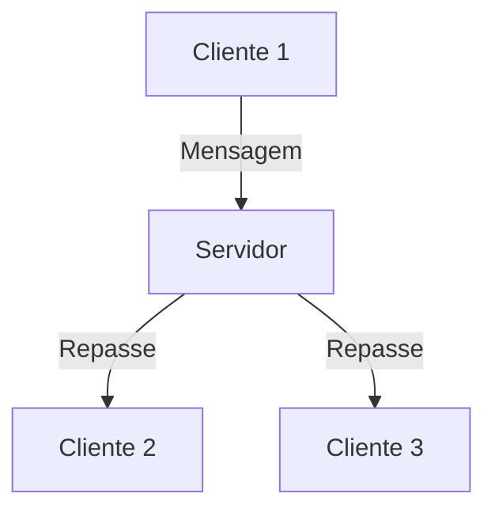

# 💬 Chat Cliente-Servidor em Java (Swing + Sockets)

Projeto acadêmico desenvolvido em **Java** com o objetivo de criar um sistema básico de registro e chat entre usuários, utilizando comunicação cliente-servidor via **sockets TCP/IP** e interface gráfica com **Swing**.

O projeto foi desenvolvido como exercício prático no **Apache NetBeans**, utilizando **JDK 23**.

---

## 🎯 Objetivo do Projeto

- Criar um sistema simples de chat multiusuário em Java  
- Exercitar conceitos de programação orientada a objetos  
- Aprender comunicação em rede utilizando sockets (TCP/IP)  
- Trabalhar persistência de dados com arquivos de texto  
- Desenvolver interfaces gráficas com Java Swing  

---

## 🛠 Tecnologias Utilizadas

- **Java (JDK 23)**  
- **Java Swing** (interface gráfica)  
- **Sockets TCP/IP**  
- **Threads** para múltiplas conexões  
- **Apache NetBeans**  
- **Git/GitHub** para versionamento  

---

## 📂 Estrutura do Projeto

- `src/` — código-fonte principal  
- `usuarios.txt` — arquivo de persistência simples para registro de usuários  
- `build.xml`, `manifest.mf` — arquivos de configuração do projeto (NetBeans)  

---

## ⚙️ Funcionalidades

### ✔ Registro de usuários
- Tela de registro para inserção de username  
- Armazenamento do nome do usuário em arquivo (`usuarios.txt`)  

### ✔ Sistema de chat
- Interface gráfica para envio e recebimento de mensagens  
- Identificação do usuário no chat  

### ✔ Comunicação cliente-servidor
- Servidor central utilizando `ServerSocket`  
- Clientes conectam via `Socket`  
- Troca de mensagens em tempo real entre usuários conectados  

### ✔ Concorrência
- Uso de threads para permitir múltiplos clientes simultaneamente  

---

## 🧩 Estrutura das Classes

- **Servidor.java** → abre a porta de comunicação, aceita conexões e gerencia múltiplos clientes  
- **Cliente.java** → realiza a conexão com o servidor e envia/recebe mensagens  
- **TelaRegistro.java** → interface gráfica para cadastro do usuário  
- **TelaChat.java** → interface gráfica do chat, exibindo mensagens e permitindo envio  

---

## ▶️ Como Executar

1. Certifique-se de ter o **JDK 23** instalado  
2. Clone o repositório:  
   ```bash
   git clone https://github.com/Christopher-m-oliver/chat-java-swing.git
   ```  
3. Abra o projeto no **Apache NetBeans**  
4. Execute primeiro a classe do **Servidor**  
5. Em seguida, execute uma ou mais instâncias do **Cliente**  
6. Registre o usuário e utilize o chat  

---

## 📚 Principais Aprendizados

- Programação orientada a objetos em Java  
- Interfaces gráficas com Swing  
- Comunicação em rede usando sockets TCP  
- Manipulação de arquivos (leitura e escrita)  
- Concorrência com threads  
- Organização e versionamento de código com Git/GitHub  

---

## 🔎 Fluxo de Funcionamento



---

## 📸 Exemplos Visuais

*(adicionar futuramente prints das telas de registro e chat para ilustrar o funcionamento)*  

---

## 📌 Observação

Projeto desenvolvido com fins educacionais e de aprendizado, não destinado a uso em produção.  
